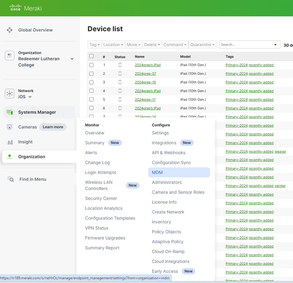

# Meraki2

How to update the Apple MDM push certificate
1.	Log into Meraki with the admin account to gain access to the “Organisation” page. 
2.	Click “MDM” 

3.	Click on “Renew” on the Apple MDM push certificate 

4.	Follow the instructions on the page “Renew Certificate” Page
 
5.	Download your certificate signing request (CSR), signed by Meraki: Meraki_Apple_CSR.csr
6.	Follow the link on the instruction and log into the Apple Push Certificate page and click on the “Info” icon to compare the “UID” number. 
PS: you can find the UID number to compare on the iPad settings
7.	Click Renew on the certificate, upload the CSR that was downloaded earlier, renew the certificate and download the .pem file.
8.	Go back to “Renew Certificate” Page on Meraki and put in the applecare@rlcb.qld.edu.au account.
9.	Upload the push certificate.
